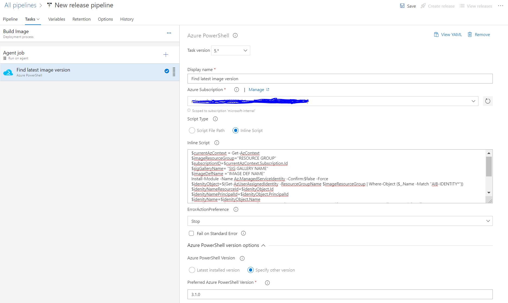
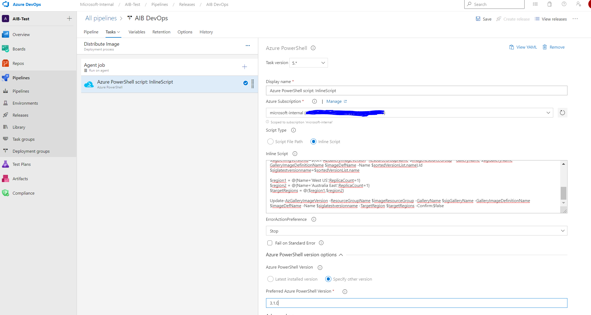

<p> 
A common customer use case which I come across is “How to keep my WVD master image up to date” especially when it comes to windows update.
Azure Image Builder DevOps Task simplifies that by providing you with DevOps Task that can run on schedule and keep your master image up to date. You can surely do a lot of things with Azure image builder but in this article, we will focus on how to automate windows update for our WVD master image and then replicate it to multiple regions. 
At the time of writing this Azure image builder is in preview and available in the following regions. 
<ul>
<li>East US</li>
<li>East US 2</li>
<li>West Central US</li>
<li>West US</li>
<li>West US 2</li>
<li>North Europe</li>
<li>West Europe</li>
</ul>
This means that the build will run only in these regions. Once the image is ready, it can be replicated to other regions through SIG. In my case it will be Australia East. You can also use AIB to distribute the image to other regions but the operation can take very long time depending upon the location and may cause the DevOps task to fail. I faced this issue, therefore I decided to just use shared image gallery for replication.
</P>
<P>Let’s get started.</P>

### Objectives
In this example we will perform simple tasks needed to keep a Windows-10 image up to date with windows update.
<ol>
<li>Find the latest Image from the Shared Image Gallery (SIG).</li>
<li>Perform windows update on this image.</li>
<li>Distribute it as a new version of the image in the same SIG.</li>
<li>Replicate it to multiple Azure regions.</li>
</ol>

### Pre-requisites
<ol>
<li>Create a resource group for AIB. I created mine in West US as its one of the supported regions.</li>
<li> <a href="https://github.com/danielsollondon/azvmimagebuilder/blob/master/quickquickstarts/0_Creating_a_Custom_Windows_Managed_Image/readme.md#step-1--enable-prereqs-1">Register AIB</a>. You can do it through Cloud Shell.</li>
<li>Create a <a href="https://docs.microsoft.com/en-us/azure/active-directory/managed-identities-azure-resources/how-to-manage-ua-identity-portal">User assigned managed identity </a></li>
<li>Give permissions to “User assigned managed identity” created in step 1. For testing purpose, I gave it contributor to subscription. For details on specific permissions read <a href="https://github.com/danielsollondon/azvmimagebuilder/blob/master/aibPermissions.md#azure-powershell-examples">this post. </a></li>
<li>Create a Shared Image Gallery in the same region as step 1. For me it was West US.</li>
<li>Place your master image in the Shared Image Gallery.</li>
</ol>

### Building AIB DevOps Task
<ul>
<li>Create DevOps project.</li>


<li>Give it a name and click create.</li>


<li>Create a Release Pipeline by clicking <b>“New Pipeline”</b>.</li>


<li>Under <b>“Select a template”</b>, click on <b>“Empty Job”</b>.</li>


<li>Name your <b>Stage</b>.</li>


<li>Click the task in <b>“Build Image”</b> stage.</li>


<li>Add a task of type <b>“Azure PowerShell”</b>.</li>


<li>Set the values in the following script, replace all the placeholder values in caps with your values. We will use this script in the next step.</li>
</ul>
```markdown
$currentAzContext = Get-AzContext
$imageResourceGroup="ROSOURCE-GROUP"
$subscriptionID=$currentAzContext.Subscription.Id
$sigGalleryName= "SIG-GALLERY-NAME"
$imageDefName ="IMAGE-DEF-NAME"
Install-Module -Name Az.ManagedServiceIdentity -Confirm:$false -Force
$idenityObject=$(Get-AzUserAssignedIdentity -ResourceGroupName $imageResourceGroup | Where-Object {$_.Name -Match "AIB-IDENTITY*"})
$idenityNameResourceId=$idenityObject.Id
$idenityNamePrincipalId=$idenityObject.PrincipalId
$idenityName=$idenityObject.Name
$getAllImageVersions=$(Get-AzGalleryImageVersion -ResourceGroupName $imageResourceGroup  -GalleryName $sigGalleryName -GalleryImageDefinitionName $imageDefName)
$versionPubList=$($getAllImageVersions | Select-Object -Property Name -ExpandProperty PublishingProfile)
$sortedVersionList=$($versionPubList | Select-Object Name, PublishedDate | Sort-Object PublishedDate -Descending | Select-Object Name -First 1)
$sigDefImgVersionId=$(Get-AzGalleryImageVersion -ResourceGroupName $imageResourceGroup  -GalleryName $sigGalleryName -GalleryImageDefinitionName $imageDefName -Name $sortedVersionList.name).Id
echo "##vso[task.setvariable variable=latestversionid]$sigDefImgVersionId"
```
<br>
<ul>
<li>Set the <b>Display Name, Subscription</b>. Copy the script created in the previous step in the <b>Inline Script</b> section and set the <b>PowerShell version</b>, you can use simply use the <b>latest installed version</b>.</li>


<li>In case if you have not noticed, we are making use of a variable called <b>“latestversionid”</b>. Lets initialize the variable in the variables section of the stage. This variable will hold the latest version id of the master image.</li>


<li>Back to our Tasks where we will add another task, this time search for image builder. Click Add on the <b>“Azure VM Image Builder Test (Preview)”</b>.If you dont have it installed then install it first</li>


<li>Set the values as appropriate to your deployment. You can find resource id for your managed identity from the properties section of the managed identity. Same is true for Image id of your Shared Image Gallery. You will have to provide a storage account, make sure that the storage account is in the same region as AIB which in my case is West US.</li>


<li>Time to rename the pipeline and save the work.</li>


<li>Click on <b>Releases</b> in the left navigation and then <b>Edit</b>.</li>


<li>This is all you need if AIB is available in your local region but if its not which in my case is true, you have to create another stage which will help to distribute the image to the local region. Why another stage? Because I found out that the overall time duration of the stage cannot be more than 60 mins if you are using Microsoft hosted agent. You can use self-hosted agent and do it all in one stage and I will highly recommend that specially for windows update customizer. In this example we are using Microsoft hosted agent so we will create another stage for image distribution.</li>


<li>Start with an <b>Empty Job</b>.</li>


<li>Name the stage.</li>


<li>Click on the Task to edit.</li>


<li>Add an <b>Azure PowerShell</b> task</li>


<li>Modify following script to suit yourself. I want to replicate this to Australia East and I had my SIG, image in West US. You can add more regions if you want to. We will use this script as Inline Script in the next step.</li>
</ul>
```markdown
$currentAzContext = Get-AzContext
$imageResourceGroup="RESOURCE-GROUP"
$subscriptionID=$currentAzContext.Subscription.Id
$sigGalleryName= "SIG-GALLERY-NAME"
$imageDefName ="IMAGE-DEF-NAME"
Install-Module -Name Az.ManagedServiceIdentity -Confirm:$false -Force
$idenityObject=$(Get-AzUserAssignedIdentity -ResourceGroupName $imageResourceGroup | Where-Object {$_.Name -Match "AIB-IDENTITY*"})
$idenityNameResourceId=$idenityObject.Id
$idenityNamePrincipalId=$idenityObject.PrincipalId
$idenityName=$idenityObject.Name
$getAllImageVersions=$(Get-AzGalleryImageVersion -ResourceGroupName $imageResourceGroup  -GalleryName $sigGalleryName -GalleryImageDefinitionName $imageDefName)
$versionPubList=$($getAllImageVersions | Select-Object -Property Name -ExpandProperty PublishingProfile)
$sortedVersionList=$($versionPubList | Select-Object Name, PublishedDate | Sort-Object PublishedDate -Descending | Select-Object Name -First 1)
$sigDefImgVersionId=$(Get-AzGalleryImageVersion -ResourceGroupName $imageResourceGroup  -GalleryName $sigGalleryName -GalleryImageDefinitionName $imageDefName -Name $sortedVersionList.name).Id
$siglatestversionname=$sortedVersionList.name
$region1 = @{Name='West US';ReplicaCount=1}
$region2 = @{Name='Australia East';ReplicaCount=1}
$targetRegions = @($region1,$region2)
Update-AzGalleryImageVersion -ResourceGroupName $imageResourceGroup -GalleryName $sigGalleryName -GalleryImageDefinitionName $imageDefName -Name $siglatestversionname -TargetRegion $targetRegions -Confirm:$false
```
<br>
<ul>
<li>Set the values in the Task and copy the script you modified in the last step and paste it in the inline script. You can rename the task if you want to. </li>


<li>22.	With that, we are all set. <b>Create release</b>.</li>


<li>During stage 1 execution you will notice that a resource group will be created in you azure subscription. This resource group will be used by AIB to create an image, AIB also provisions a storage account to keep packer logs and temp VHDs. Once the image is successfully created, it will be distributed to the SIG and removed from the resource group.</li>


<li>Towards the end of stage 1, you will notice that the image is being distributed to the SIG. you can find this out by going into the image definition of the SIG.</li>


<li>If you click on the image version, you can see the replication status in the update replication section.</li>


<li>After the completion of stage 1, stage 2 will start the replication of image to other regions. In my case its Australia East, you can change it in the script to any Azure region</li>


<li>Lastly, you can schedule the Tasks to run on Schedule </li>


</ul>
<p>
In case if a stage is taking longer than 60 mins then I will recommend using the self-hosted agent. Even if your DevOps task fails, you will observe that the actual build goes on and completes for that stage.
</p>
There is a lot more, you can do with AIB DevOps Task if you have dynamic customizations that you want to execute each time with the build cycle. We are not using any other customization except for windows update but you can add your customization as an artifact which could be as simple as a PowerShell in a code repository for example.
<p>
I hope this was useful, happy building.
</p>